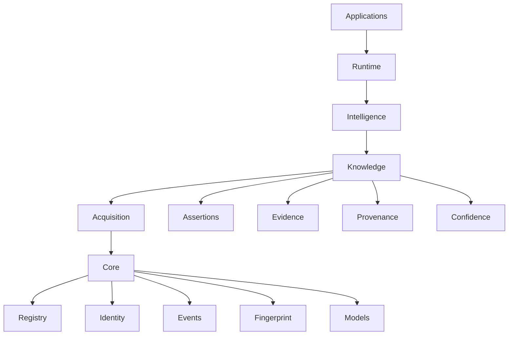

# PRIZM Platform Architecture

This document defines the platform-level architecture of PRIZM. It is intended to be the primary architectural overview for the system and should be read as a high-level map of responsibilities, flows, and boundaries.

## 1. Layered architecture

PRIZM is organized as a layered platform with a strong foundation in Core and a progressive accumulation of knowledge, interpretation, and application behavior above it.

## 2. Responsibilities of each layer

### Core

Core is the stable and reusable foundation of the platform. It provides shared abstractions, contracts, and infrastructure that higher layers depend on. Core remains domain-agnostic and should not encode product-specific behavior.

### Acquisition

Acquisition is responsible for bringing external or internal input into the platform. It captures raw signals, imports, observations, and other forms of incoming data. Its role is to introduce information into the system in a structured and traceable way.

### Knowledge

Knowledge is responsible for representing what the platform believes, why it believes it, and how strongly it believes it. It manages assertions, evidence, provenance, and confidence in a way that is explainable and maintainable.

### Intelligence

Intelligence interprets and derives understanding from the knowledge layer. It transforms evidence and context into useful reasoning, analysis, and derived views. It should not own the underlying knowledge model, but it may consume it.

### Runtime

Runtime coordinates operational execution and service interaction. It ensures that subsystems can work together coherently while preserving separation of responsibilities.

### Applications

Applications are user-facing or workflow-facing experiences. They consume platform capabilities and present them in practical ways for users, operators, analysts, or administrators.

## 3. Data flow

Data flows through PRIZM in a disciplined sequence:

1. Acquisition collects raw input.
2. Core services normalize, identify, and structure data where needed.
3. Observations are produced as the first structured representation of incoming information.
4. Evidence and provenance are attached as the platform builds understanding.
5. Assertions represent durable beliefs grounded in that evidence.
6. Intelligence and Applications consume the resulting knowledge for analysis, interaction, and action.

This sequence ensures that raw data does not become action directly, but is first converted into a structured and explainable form.

## 4. Knowledge flow

Knowledge in PRIZM is built from a deliberate progression:

- Observation captures what was seen or received.
- Evidence explains why a claim should be trusted.
- Assertion expresses what the system believes.
- Confidence reflects the strength of the belief based on supporting evidence.
- Relationships are derived from assertions rather than treated as the primary source of truth.

This flow preserves explainability. The platform can always answer not just what is believed, but why it is believed and how strongly.

## 5. Core subsystem responsibilities

### Registry

The Registry owns object registration and lifecycle awareness for known objects. It creates the authoritative boundary for object presence within the platform.

### Identity

The Identity subsystem resolves identity-like values and ensures consistent recognition across the platform. It is responsible for matching and normalization rather than object creation.

### Events

The Events subsystem provides a generic mechanism for coordination and propagation of change. It supports decoupled interaction between subsystems without embedding domain semantics.

### Fingerprint

The Fingerprint subsystem provides deterministic hashing and canonicalization for content comparison and identity-related workflows. It supports stable comparison without introducing domain logic.

### Models

The Models layer defines the common contracts and abstractions used across the platform. These models preserve consistency and reduce ambiguity across subsystems.

## 6. Application responsibilities

Applications are responsible for turning platform capabilities into useful experiences. They should not define the architecture of the platform itself, but instead consume and present capabilities in a coherent, task-oriented way.

Applications may provide:

- operational views
- investigative workflows
- knowledge exploration interfaces
- reporting and interpretation surfaces
- user interaction around evidence and assertions

Applications should remain focused on usability and task completion while relying on the platform layers below for correctness, consistency, and explainability.

## 7. Future extension points

PRIZM is designed to evolve without breaking its architectural principles. Future extension points include:

- richer evidence and provenance models
- more expressive confidence and conflict handling
- additional knowledge views and projections
- broader acquisition adapters and normalization patterns
- deeper integration between intelligence and knowledge layers
- enterprise-grade governance, collaboration, and audit patterns

These extensions should preserve the central platform ideas of explainability, traceability, local-first operation, and evidence-backed knowledge.
