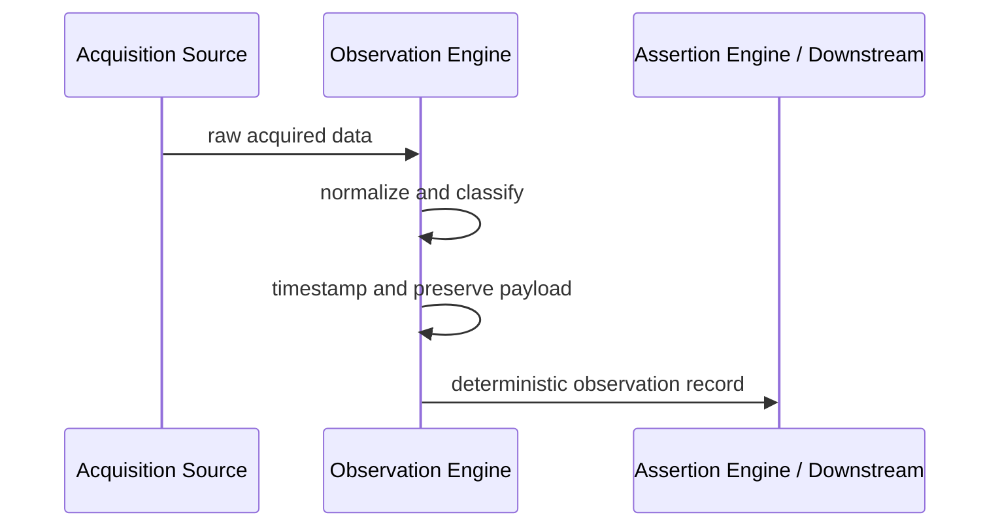

# RFC-0001: Observation Engine

## Status

Proposed

## Purpose

The Observation Engine is responsible for converting raw acquired data into engineering observations. Its purpose is to create a normalized, traceable, and deterministic representation of what was observed, without making claims about belief, confidence, or knowledge structure.

The Observation Engine exists to provide a clean boundary between acquisition and interpretation. It transforms incoming signals into structured observations that can later be used by downstream reasoning layers.

## Responsibilities

The Observation Engine shall be responsible for:

- representing observations as first-class records
- normalizing observation values into a consistent form
- attaching timestamps and observation context
- classifying the source of the observation
- preserving the raw payload for traceability
- producing deterministic observation records from input data

## Non-responsibilities

The Observation Engine shall not be responsible for:

- creating assertions
- storing knowledge
- computing confidence
- building relationships
- resolving identity beyond basic normalization needs
- interpreting observations as truth claims

These concerns belong to downstream subsystems and must remain outside the Observation Engine boundary.

## Observation model

An observation should be represented as a structured record with the following conceptual properties:

- id: a stable identifier for the observation record
- source: the origin of the observation
- sourceType: the classification of the source
- observedAt: the time the observation occurred or was recorded
- receivedAt: the time the observation entered the system
- subject: the entity or context the observation refers to
- payload: the original or normalized content of the observation
- summary: a compact representation of the observation value
- metadata: contextual information such as location, channel, batch, or version

The model should preserve both the normalized representation and the raw payload so that later analysis can remain explainable.

## Observation lifecycle

The Observation Engine should follow a simple lifecycle:

1. Intake
   - Raw acquired data enters the engine from an acquisition boundary.

2. Normalize
   - The observation is converted into a canonical structure.

3. Classify
   - The source and source type are identified.

4. Timestamp
   - The observation is assigned relevant time values.

5. Record
   - The observation is emitted as a deterministic observation record.

6. Hand off
   - The record is passed to downstream systems for evidence, assertion, or reasoning use.

This lifecycle should be deterministic and should not depend on domain-specific logic.

## Observation source taxonomy

The Observation Engine should support a simple taxonomy for source classification. At minimum, the taxonomy should distinguish between:

- direct system input
- imported data
- user-provided observation
- derived observation
- external feed
- historical record

The taxonomy should remain extensible but must remain simple enough to be understood and reviewed.

## Integration with Acquisition

The Observation Engine is the bridge between acquisition and interpretation.

Acquisition is responsible for collecting raw data from external or internal sources. The Observation Engine is responsible for turning that raw input into a normalized observation format. In this sense, Acquisition should not need to decide the structure of observations beyond passing the data to the engine.

This separation keeps acquisition focused on intake, while the Observation Engine focuses on representation and normalization.

## Integration with Assertion Engine

The Assertion Engine consumes observations as input for downstream interpretation. It should not directly own observation normalization or lifecycle.

The Observation Engine should emit deterministic observation records that may later be used as evidence or as the basis for assertions. This keeps the Assertion Engine responsible for belief formation rather than observation representation.

## Sequence diagram

## Future evolution

The initial version of the Observation Engine should remain intentionally small. Future evolution may include:

- richer source taxonomies
- more structured normalization policies
- support for observation streams and event sequences
- stronger validation and conflict detection
- integration with provenance and confidence models

The design should remain domain agnostic and should avoid coupling to any specific product workflow in v1.
